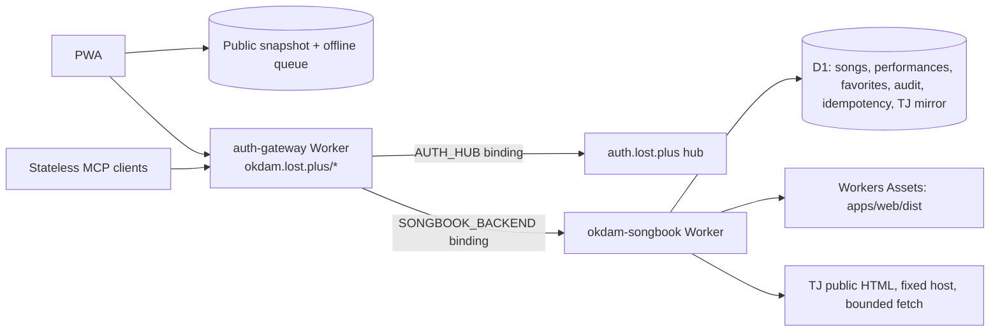

# Architecture

Songbook is a mobile-first PWA served by one Cloudflare Worker behind the
Common Auth cloud gateway. The catalog is public; protected browser writes and
MCP use `auth.lost.plus` identity that the gateway validates and injects, and
D1 owns application state.

## Frontend

- Svelte + TypeScript + Vite PWA in `apps/web`, built to `apps/web/dist`.
- `CatalogPage.svelte` is the catalog-first primary surface: search, quick
  filters, account/session state, theme, sync details, and contextual entry to
  role-aware management sheets. `/admin` is a compatibility alias served by
  the SPA fallback.
- `vite-plugin-pwa` generates the service worker and manifest.
- Dexie stores public snapshots and the offline performance queue. Protected
  auth/session responses and credentials must not enter those caches.

## Worker

- `apps/worker/src/index.ts` is the only entry point. It builds the Hono
  application from `apps/server` once per isolate over a D1 executor, mounts
  it, and serves everything else from Workers Assets with an `index.html`
  fallback. `/api`, `/mcp` and `/.well-known` never fall back to the shell.
- `apps/server` is the Hono application: public catalog with ETag, protected
  same-origin browser API, `/healthz`, and `/mcp`. It reads identity only
  from the gateway's `x-lost-plus-*` headers and validates no credential.
  Decoding is the shared `@lost-plus/gateway-identity` package; `auth.ts`
  adds the email lower-casing and role narrowing this codebase keys on.
- `packages/server-core` holds the domain service, repositories, the SQL
  executor abstraction (`sql.ts`) with its one implementation on D1
  (`d1.ts`), and the TJ adapter and mirror. Tests reach D1 semantics through
  a better-sqlite3-backed fake of the binding (`test/fake-d1.ts`).
- `packages/songbook-mcp` registers the eight MCP tools on
  `@modelcontextprotocol/server` v2 through `createMcpHandler`, stateless,
  with the legacy fallback for 2025-era clients.
- `packages/shared` holds contracts, schemas, search, permissions and TJ
  parsing shared with the web app.

## Identity and authorization

- The gateway validates the browser cookie or bearer token against the hub,
  strips it, and forwards with `x-lost-plus-{sub,email,name,role}` percent-
  encoded and `x-lost-plus-encoding: percent-utf8`. A missing, incomplete or
  undecodable identity is refused on protected paths.
- The application owns authorization: every admitted identity gets the single
  `allowed` role. Favorites and idempotency are keyed by the immutable subject
  `auth.lost.plus:`.
- Browser mutations additionally require JSON bodies, an exact `Origin`, and
  an `X-Songbook-Owner-Subject` matching the identity.

## MCP transport and authorization

- `/mcp` is the gateway's `mcp` policy with token scope `okdam-mcp`. The
  gateway answers requests without a valid credential; the application also
  refuses any MCP request without gateway identity before dispatch.
- Read tools require `songbook:read`, mutation tools `songbook:write`; every
  admitted identity holds both.
- `tools/list` is advertised as cacheable for five minutes, `private`.
- `search_songs` returns saved matches and a TJ section; TJ is consulted only
  for authenticated read-scoped searches and local matches survive TJ failure.

## Live TJ adapter

- The adapter builds a fixed `tjmedia.com/song/accompaniment_search` URL,
  fetches server-rendered HTML, parses rows, bounds pagination and result
  size, and throttles upstream fetches.
- Exact canonical queries are mirrored in D1 for 24 hours. A stale request
  waits for refresh; a failed refresh serves the older snapshot and records
  failure metadata. Parser drift, upstream failure, empty results and rate
  limiting are structured errors; manual entry remains available.

## D1 specifics

- No interactive transactions: `transaction()` is a pass-through, a
  mutation that throws releases its idempotency claim by hand, and a partial
  failure can leave a song without its audit row. See `docs/deployment.md`.

## Removed code

The Google Sheets/Apps Script backend, the ChatGPT Actions OAuth bridge, the
Node-only SQLite admin and CSV import tools, and the better-sqlite3/drizzle
storage path were removed on 2026-09-19 (DEC-20260919-002). They live in git
history before that date.
