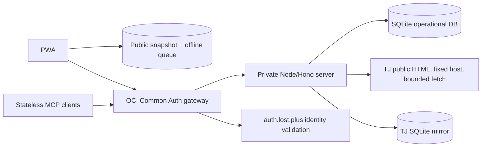

# Architecture

Songbook is a mobile-first PWA served by one Node/Hono application on OCI. The
catalog remains public; protected browser writes use shared `auth.lost.plus`
sessions through the local Common Auth gateway, and SQLite owns application
state.

## Frontend

- React, TypeScript, Vite, and React Router.
- `BrowserRouter` uses `/okdam-songbook/` basename.
- `PublicPage` is the catalog-first primary surface. It owns search, quick
  filters, account/session state, theme, sync details, and contextual entry to
  role-aware management sheets.
- `AdminPage` is embedded for add, manage, and history surfaces. `/admin` is a
  compatibility route to the same `PublicPage` composition.
- `vite-plugin-pwa` generates the service worker and manifest.
- Dexie stores public snapshots and offline performance queue items. Protected
  auth/session responses and credentials must not enter those caches.

## Node application

- One Node/Hono process serves the PWA, same-origin API,
  health endpoint, and stateless MCP endpoint.
- SQLite is the operational source of truth for songs, performances, audit and
  idempotency state, and the TJ mirror. Identity, sessions, bearer tokens,
  service admission, and revocation live in `auth.lost.plus`.
- The retired Apps Script/Sheets implementation remains historical migration
  material only; it is not on the live request path.

## MCP transport and authorization

- `/mcp` is a required-bearer mount serving modern and legacy stateless MCP
  exchanges without long-lived MCP session state.
- Requests without gateway identity fail with `401` before MCP dispatch,
  including initialization, discovery, listing, and read-only tool calls.
- The gateway evaluates every OAuth access token or explicit machine credential at `auth.lost.plus`;
  malformed, expired, revoked, and incorrectly scoped credentials are rejected
  before Node. Cookies never provide MCP identity.
- The single tool-policy table requires `songbook:read` for read tools and
  `songbook:write` for mutation tools after transport admission.
  Every authenticated request reaches the shared service with verified
  percent-encoded identity headers.
- `search_songs` always returns saved matches and a TJ section. Anonymous
  searches never invoke TJ; authenticated read-scoped eligible searches use
  the existing mirror-backed adapter and preserve local matches when TJ fails.

## Live TJ adapter

- Browser requests only typed lookup/search/add/restore actions.
- The Node adapter builds a fixed `tjmedia.com/song/accompaniment_search` URL,
  fetches server-rendered HTML, parses result rows, strips markup/entities,
  bounds pagination and result size, and throttles upstream fetches.
- Exact canonical queries are mirrored in SQLite for 24 hours. A stale request
  waits for refresh; successful rows update the normalized song index and
  ordered query membership. A failed refresh serves the older snapshot when
  available and records operational failure metadata.
- Parser drift, upstream failure, empty results, and rate limiting are
  structured errors. Manual entry remains available.
- Candidate source URLs come from the serving query snapshot. Immediate add
  uses duplicate checks and `clientRequestId` replay safety.

## Legacy Apps Script and Worker code

The former Apps Script/Sheets API and Cloudflare Worker integration are
retained as legacy source and migration context. They are not live request
boundaries after the OCI cutover.

## Separate legacy ChatGPT OAuth

The Worker’s `/authorize`, `/oauth/callback`, `/token`, and `/api/gpt*` routes
remain a separate OAuth protocol for ChatGPT Actions. Shared browser sessions
do not replace its redirect allowlist, bearer token, or GPT action contracts.
