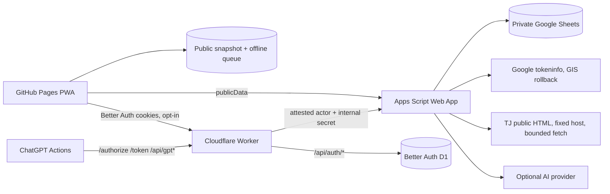

# Architecture

Songbook is a static GitHub Pages PWA, a Sheet-backed Apps Script API, and an
existing Cloudflare Worker integration boundary. The catalog remains public;
protected browser writes use the selected session transport and Apps Script
still owns current role resolution.

## Frontend

- React, TypeScript, Vite, and React Router.
- `BrowserRouter` uses `/okdam-songbook/` basename.
- `PublicPage` is the catalog-first primary surface. It owns search, quick
  filters, account/session state, theme, sync details, and contextual entry to
  role-aware management sheets.
- `AdminPage` is embedded for add, manage, and history surfaces. `/admin` is a
  compatibility route to the same `PublicPage` composition.
- `vite-plugin-pwa` generates the service worker and manifest.
- Dexie stores public snapshots and offline performance queue items. Protected
  auth/session responses and credentials must not enter those caches.

## Apps Script API

- Apps Script exposes one action-routed `doGet`/`doPost` Web App.
- Public `publicData` reads remain direct and unauthenticated.
- Legacy browser writes can carry a Google ID token; Apps Script verifies it
  and resolves `ALLOWED_USERS_JSON`.
- Better Auth browser writes arrive from the Worker with an internal secret and
  Worker-attested actor metadata. Apps Script validates the internal pattern,
  independently looks up the email in its allowlist, and applies the existing
  permission matrix.
- Sheet access uses header maps, row updates, versions, `LockService`, and
  `ChangeLog` records.

## TJ adapter

- Browser requests only typed lookup/search/add/restore actions.
- Apps Script builds a fixed `tjmedia.com/song/accompaniment_search` URL,
  fetches server-rendered HTML, parses result rows, strips markup/entities,
  bounds pagination and result size, caches for 30 seconds, and throttles
  upstream fetches.
- Parser drift, upstream failure, empty results, and rate limiting are
  structured errors. Manual entry remains available.
- External candidates carry a source URL and stay editable until the Sheet
  write succeeds. Immediate add uses duplicate checks and `clientRequestId`
  replay safety.

## Cloudflare Worker auth

- Better Auth is instantiated per request so D1 bindings and secrets are not
  captured at module evaluation time.
- `/api/auth/*` is the Better Auth Google OAuth handler.
- `/api/session` returns the Worker session plus Apps Script-authoritative
  current-user role.
- `/api/browser/*` admits only the named protected browser actions and forwards
  derived actor metadata to Apps Script.
- The source configuration uses 14-day sessions, one-day renewal age,
  `SameSite=None; Secure; HttpOnly` cookies, and exact credentialed CORS
  origins. `BETTER_AUTH_ENABLED=false` keeps this path disabled by default.

## Separate ChatGPT OAuth

The Worker’s `/authorize`, `/oauth/callback`, `/token`, and `/api/gpt*` routes
remain a separate OAuth protocol for ChatGPT Actions. Better Auth browser
sessions do not replace its redirect allowlist, bearer token, or GPT action
contracts.
